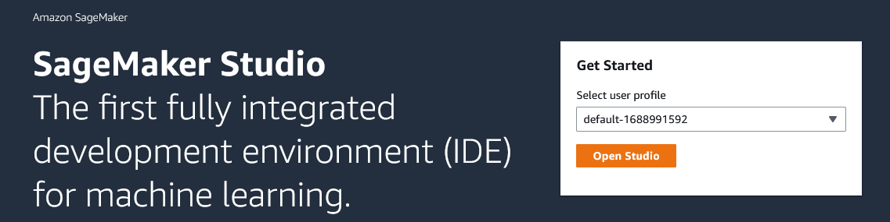
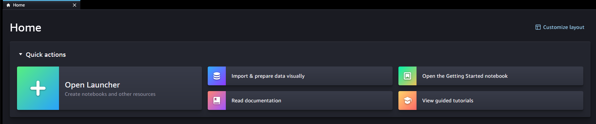
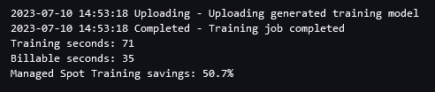
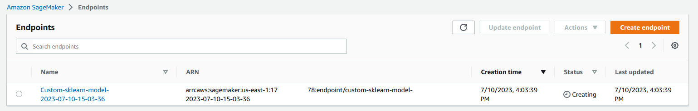
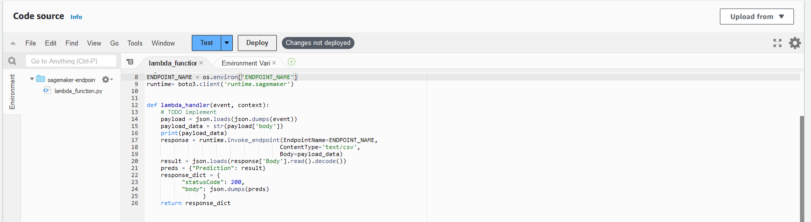
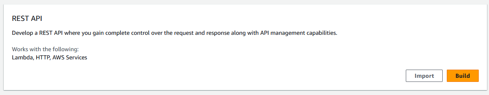
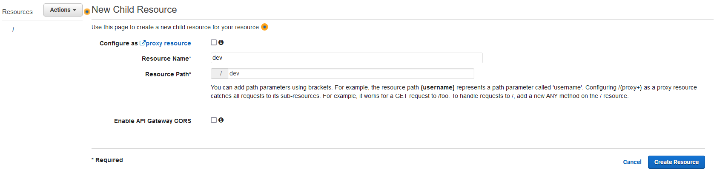
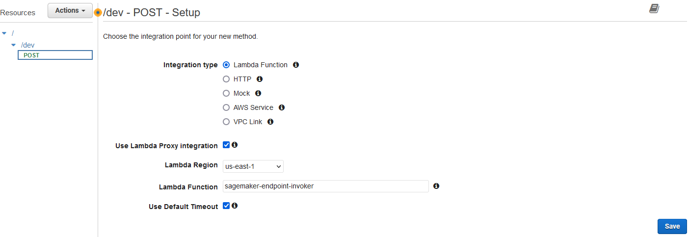
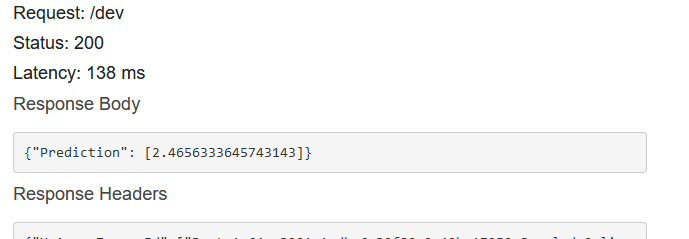
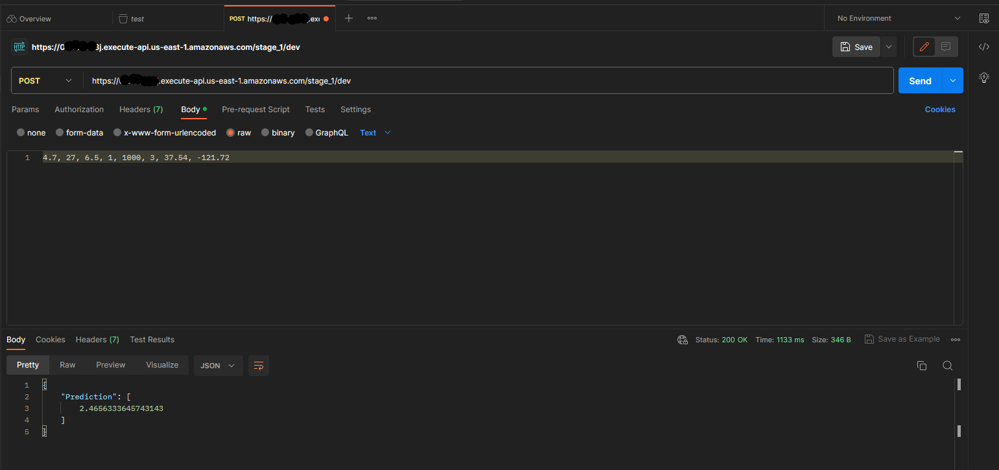

# Create Rest API for Sagemaker Endpoint using Lambda & API Gateway

    

This repo contains a Lambda function and a notebook which is to be run in SageMaker Studio to build a machine learning model to predict house prices using using the [California Housing](https://scikit-learn.org/stable/modules/generated/sklearn.datasets.fetch_california_housing.html) dataset, present in Scikit-Learn. A Sagemaker Endpoint is deployed for the model. 

Next, a Lambda function and Rest API in API Gateway are created and the API is deployed. The API is then tested in Postman and with Python code written in the notebook.

Detailed here:

&#9745; Deploy the SageMaker Endpoint with SageMaker Studio

&#9745; Create & deploy the Lambda function

&#9745; Deploy Rest API in API Gateway


## Deploying the SageMaker Endpoint with SageMaker Studio

1. Create a bucket in S3 that SageMaker will use to store artifacts.

2. Open the SageMaker console, click 'Domains' on the side panel and then click 'Create domain'.

3. Choose a domain name, and User profile name.

4. Choose or create a execution role. The execution role must have access to S3 or the S3 bucket that you have just created.

    

5. When the domain is up and running click 'Studio' on the side panel and select the 'User profile' that you just created:

    

6. In the SageMaker Studio 'Home' tab, select 'Open Launcher'

    

7. In the SageMaker Studio Launcher with the following environment configuration - Click the file browser on the left pane and upload the notebook. A window will opo up, confirm the environment configuration. 

    

8. Follow the steps in the notebook. 

    The first training is done locally within the notebook. 
    
    The second training happens inside the SageMaker container. The output of the model training will produce some outputs and summaries ending with this:

    


9. Complete the rest of the notebook to store the model artifacts in S3 and deploy the SageMaker Endpoint for the trained model. 

    Verify the Endpoint has been created by going to SageMaker console -> Inference -> Endpoints.

    

## Create the Lambda Function

1. Go to Lambda in AWS and create a function.

2. Choose 'Author from scratch', choose 'Function name', Runtime: Python 3.9

    Change default execution role -> Create a new role with basic Lambda permissions

    Now create function.

3. Add the contents of lambdafunction.py into lambda_function entry box on the 'Code' tab

    

4. Go to 'Configuration' tab -> 'Environment Variables' -> Edit -> 'Add Environment Variable'

    `KEY: ENDPOINT_NAME`

    `VALUE: <YOUR_ENDPOINT_NAME>`

5. Attach policy to Lambda execution role:
    ```json
    {
        "Version": "2012-10-17",
        "Statement": [
            {
                "Sid": "VisualEditor0",
                "Effect": "Allow",
                "Action": "sagemaker:InvokeEndpoint",
                "Resource": "*"
            }
        ]
    }
    ```


## Deploy Rest API in API Gateway

1. Go to API Gateway and select 'Build' REST API

    

2. Click 'REST' -> 'New API' -> choose a name -> Regional -> Create API

3. Select 'Actions' -> 'Create Resource'. Call it 'dev'

    

4. Select 'Actions' -> 'Create Method' and select 'POST'. Complete the following:

    

5. Test the method using the following come values:

    ```
    4.7, 27, 6.5, 1, 1000, 3, 37.54, -121.72
    ```
    This prediction returns `2.4656333645743143`

    

6. Actions -> Deploy API


7. Test API with Python Script in the notebook:

    ```python
    import requests

    url = "<API URL>"

    payload = "<insert test data>"

    headers = {
      'Content-Type': 'text/csv'
    }

    response = requests.request("POST", url, headers=headers, data=payload)

    print(response.text)    
    ```

8. Test API with Postman:

    

You should observe that the same prediction has succesfully been returned! This project is now complete!