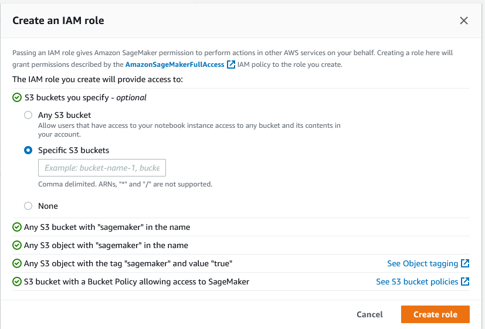

# Create Rest API for Sagemaker Endpoint using Lambda & API Gateway

    

This repo contains a Lambda function and a notebook which is to be run in Sagemaker Studio to build a machine learning model to predict house prices using using the [California Housing](https://scikit-learn.org/stable/modules/generated/sklearn.datasets.fetch_california_housing.html) dataset, present in Scikit-Learn. A Sagemaker Endpoint is deployed for the model. Next, a Lambda function and Rest API in API Gateway are created and the API is deployed. The API is then tested in Postman and with Python code written in the notebook.

## Setup Overview
1. Create a bucket in S3 that Sagemaker will use to store artifacts.
2. Run house-price-prediction.ipynb in Sagemaker studio to deploy the Sagemaker Endpoint.

1. Open the SageMaker console and select 'Create a domain'.

2. Choose a domain name, and User profile name.

3. Choose or create a execution role. The execution role must have access to S3 or the S3 bucket that you have just created.


4. Open the Sagemaker studio, upload the notebook and run it.

5. Create Lambda function with lambdafunction.py

6. Attach policy to Lambda execution role:
    ```json
    {
        "Version": "2012-10-17",
        "Statement": [
            {
                "Sid": "VisualEditor0",
                "Effect": "Allow",
                "Action": "sagemaker:InvokeEndpoint",
                "Resource": "*"
            }
        ]
    }
    ```

7. Create Rest API in API Gateway

8. Deploy API

8. Test API with Python Script (or Postman)

    ```python
    import requests

    url = "<API URL>"

    payload = "<insert test data>"

    headers = {
      'Content-Type': 'text/csv'
    }

    response = requests.request("POST", url, headers=headers, data=payload)

    print(response.text)    
    ```

